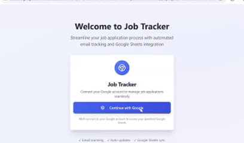

# Automated Job Tracker

Do you apply to hundreds of jobs then often forget to track their statuses since there are too much? Yeah, same here. So I created an app that can automatically read you email and update the job application status to Google sheet. This saved me so much time and I hope it would do the same for you.

## Features

- Fetch unread recruiter emails from Gmail
- Extract job application data (job title, company name, application status) from emails
- Store and manage job application data in a PostgreSQL database
- View and edit job application data through a REST API
- Clear email records from the database
- Integrate with Google Sheets for job data storage
- OpenAI API integration for advanced processing

## Usage

Here is a step by step tutorial on how to use the app.
1. Login with your Google account
    - If you see the screen this app is not secured, I haven't done verifying it with Google yet (sorry it takes 4 - 6 weeks). I would try to complete this ASAP.

2. Connect the desired Google sheet.
    - Create a Google sheet to track your job. Put the link to the sheet in the Google sheet tab and hit "Connect".

3. (First time user only) If you are first time user, the app will ask you to put a time from which you want it to read the email.

4. Hit fetch job.
    - After the first time user set up, the next time you hit "Fetch Job", it would automatically handles emails based on your last time using the app.

5. Open the Google sheet and you will see the jobs automatically added.

## Upcoming features

- [ ] Replace OpenAI API with self-hosted model for better clarity
- [ ] Feature: Allow user to choose a timeframe to handle email
- [ ] Email and in-app notifications for status updates
- [ ] Tagging and categorization of job applications  

## Contributing

Contributions are welcome! Please refer to [CONTRIBUTING.md](CONTRIBUTING.md) for more details.

## License

This project is licensed under the MIT License. See the LICENSE file for more details.
